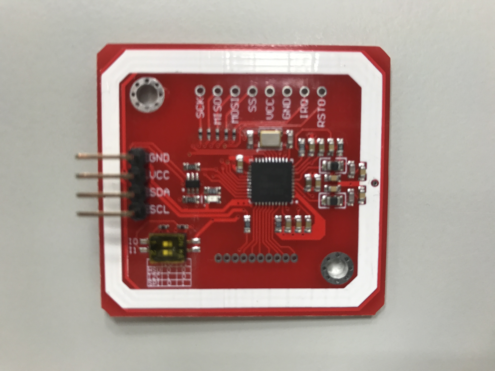
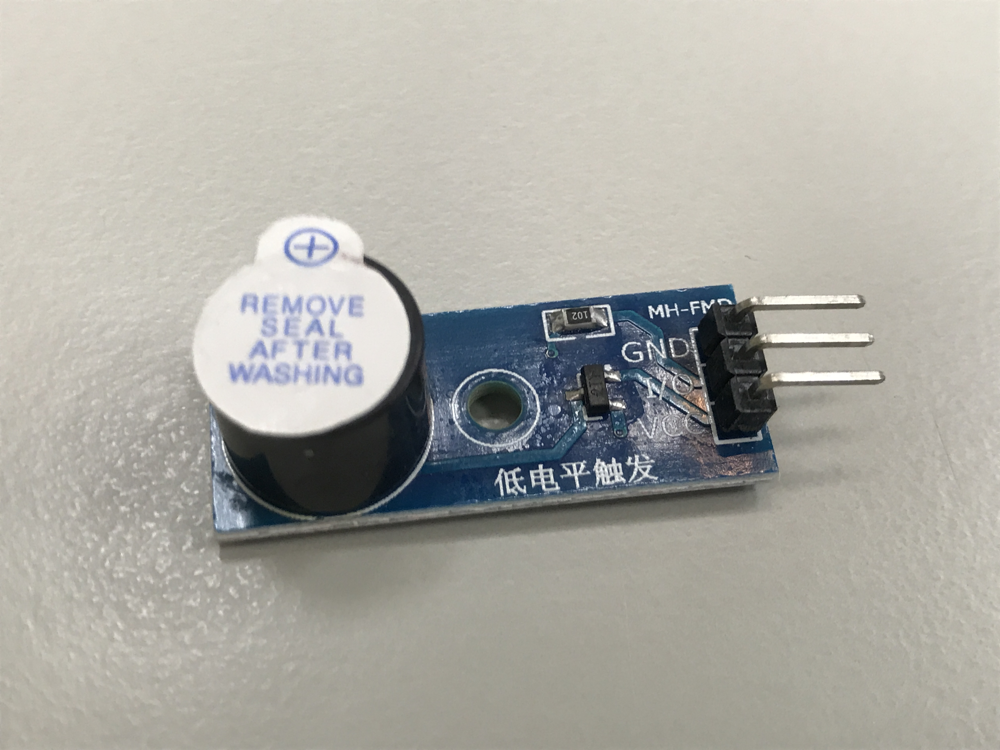

# Proximity Card Reader with Arduino using PN532 module

The goal of the project is to provide a hardware of proximity card reader with Arduino that can integrates with the attendance tracker system. In this example we used the PN532 sensor shield and you can easy to buy it from [Taobao](https://world.taobao.com/), [Amazon](https://www.amazon.com/) or other shopping service.

## Overview

This example will read the serial number on the card or tag and display it in the serial monitor and sound a buzzer.

**PN532 Sensor Shield**

**Buzzer Module**

> Low level trigger

## Getting Started

**Using the [Arduino IDE](http://www.arduino.cc/en/main/software) to program**

  * Refer to the [Getting Started](https://www.arduino.cc/en/Guide/HomePage) page for Installation instructions.

**Install the [PN532](https://github.com/elechouse/PN532) library**

  * Download the [PN532 library](https://github.com/elechouse/PN532/archive/PN532_HSU.zip).
  * Open the IDE and click to the `Sketch` menu and then `Include Library` > ` Add .ZIP Library...` into libraries of Arduino.

**Connections**

  * Switch setting for PN532

    | Interface             | Channel 1 | Channel 2 |
    | --------------------- | --------- | --------- |
    | HSU (High Speed UART) | `OFF`     | `OFF`     |
    | I2C                   | `ON`      | `OFF`     |
    | SPI                   | `OFF`     | `ON`      |

  * Typical pinouts

    | PN532           | Arduino Pro Micro |
    | --------------- | ----------------- |
    | `GND`           | `GND`             |
    | `VCC`           | `VCC` `3.3V`      |
    | `SDA` `HSU TXD` | `0` `RX`          |
    | `SCL` `HSU RXD` | `1` `TX`          |

    | Buzzer Module   | Arduino Pro Micro |
    | --------------- | ----------------- |
    | `GND`           | `GND`             |
    | `I/O`           | `5`               |
    | `VCC`           | `VCC` `3.3V`      |

## License

This project is licensed under the terms of the MIT license. See the [LICENSE](../../LICENSE) file for more details.